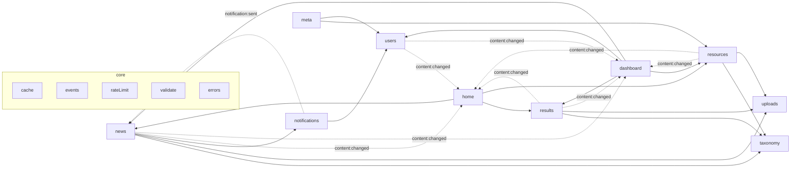
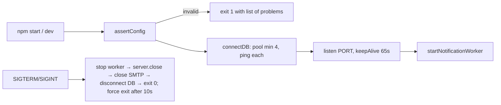
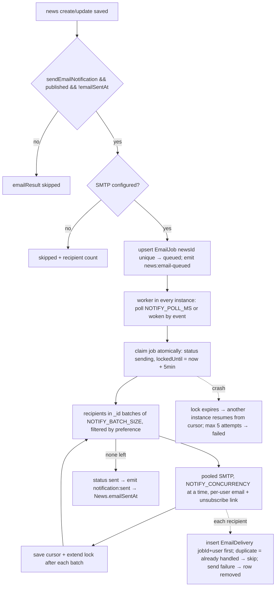
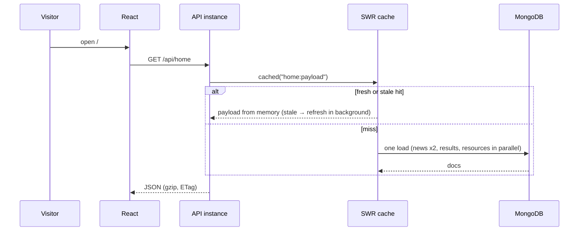

# Mathematical Olympiad CMS — Complete FE + BE Flow

> Living document. Update it whenever code changes or something new is discovered (see [Changelog](#10-changelog) at bottom).
> Last reviewed: 2026-09-28 (sessions, admin management, cache sync, delivery log, storage driver, tests)

---

## 1. What this app is

Full-stack CMS for publishing Mathematical Olympiad updates, built to run as **several stateless API instances** behind a load balancer.

- **Public site** — visitors read/search/filter news (paged), open detail pages, view results, download resources. No public sign-up.
- **Admin CMS** — admins log in (httpOnly session cookie), manage other admins and passwords, create/edit/publish/unpublish/delete news (image + attachment; large files go straight to Cloudflare R2), CRUD results and resources, manage **Users** (email recipients), manage levels/categories.
- Publishing news with "Send email notification" queues a **background email job** that emails matching active users once (per-user email with unsubscribe link).

| Layer    | Tech | Port / URL |
|----------|------|------------|
| Frontend | React 18, Vite 8, React Router 7, plain CSS (admin code lazy-loaded); Node ≥ 20.19 | `http://localhost:5173` |
| Backend  | Node ≥18 (ESM), Express 4, Mongoose 8, JWT, bcryptjs, Multer, Nodemailer, helmet, compression, AWS S3 SDK (R2) | `http://localhost:5001/api` |
| DB       | MongoDB (Atlas in the current `.env`) | `MONGODB_URI` |

---

## 2. Backend architecture

### 2.1 Layout

```
backend/src/
├── server.js            # boot: validate config → connect DB (warm pool) → listen → start email worker; graceful shutdown
├── app.js               # createApp(): middleware, module mounting, error handler (no listen → testable)
├── config/
│   ├── env.js           # ONLY place that reads process.env → frozen `config` + assertConfig()
│   └── db.js            # mongoose connect (pool, timeouts, autoIndex), pool warm-up, isDbReady()
├── core/                # feature-agnostic building blocks; never imports a module
│   ├── errors.js        # AppError + badRequest/notFound/conflict/unauthorized/tooMany
│   ├── asyncHandler.js  # forwards async errors to the error handler
│   ├── validate.js      # pick, toBool, assertSafeUrls, queryString, paging, EMAIL_PATTERN
│   ├── cache.js         # stale-while-revalidate + single-flight in-process cache
│   ├── events.js        # in-process event bus (decouples modules)
│   ├── rateLimit.js     # fixed-window limiter, store "mongo" (shared) or "memory" (per instance)
│   ├── scheduler.js     # cron-style jobs, once per interval across all instances (JobRun lock in MongoDB)
│   ├── contentChanged.js# write → invalidate local cache + event + bump CacheVersion; polls for other instances' bumps
│   ├── cookies.js       # tiny cookie parser
│   └── security.js      # helmet headers, upload response headers
├── modules/             # one folder per feature: model / service (logic + DB) / routes (HTTP only)
│   ├── index.js         # registry: the list of modules that app.js mounts
│   ├── auth/            # Admin model, cookie session (JWT inside), CSRF guard, admins CRUD, change/reset password
│   ├── news/            # News model, public list/detail, admin CRUD, slugs, queues emails
│   ├── results/         # Result model + CRUD
│   ├── resources/       # Resource model (+RESOURCE_TYPES) + CRUD
│   ├── users/           # Subscriber model ("Users" in UI), admin CRUD, recipients, unsubscribe
│   ├── taxonomy/        # levels/categories, assertTaxonomy, usage registry
│   ├── notifications/   # EmailJob + EmailDelivery models, pooled mailer, enqueue, background worker
│   ├── uploads/         # storage driver (R2 when configured, else disk), R2 direct/multipart uploads, 9.5 GB quota, scheduled storage jobs, Media model
│   ├── home/            # composition: GET /api/home (reads news/results/resources services)
│   ├── dashboard/       # composition: GET /api/admin/dashboard
│   └── meta/            # GET /api/meta: option lists the FE needs (resource types, preferences)
└── scripts/
    ├── seed.js          # non-destructive: upsert admin + add missing default levels/categories
    ├── sync-indexes.js  # create/update all indexes (run on deploy)
    └── check-config.js  # validate .env
backend/test/            # node:test suites (auth, content, notifications) + harness with fake SMTP
```

### 2.2 Module rules (how features stay independent)

- A module exposes any of `publicRouter` (→ `/api`), `openAdminRouter` (→ `/api/admin`, no auth), `adminRouter` (→ `/api/admin`, behind `requireAdmin`). `modules/index.js` lists them; `app.js` mounts them. **Add a feature = new folder + one line in `index.js`.**
- `routes.js` only parses HTTP and calls the service. `service.js` holds rules + DB access. Models are private to their module.
- Cross-module needs go one way only, or through `core/events.js` / registries:
  - `news → notifications` (`enqueueNewsEmail`), `notifications → users` (recipients). Notifications never imports news: the job stores a snapshot of the email content, and on success emits `notification:sent`, which news listens to (sets `emailSentAt`).
  - `taxonomy` never imports content modules: news/results/resources call `registerTaxonomyUsage(fn)`; taxonomy asks all checkers before a delete.
  - Caches: each module calls `contentChanged(module, prefixes)` on writes → its keys are invalidated, `content:changed { module }` is emitted (`home`, `dashboard` listen), and a `CacheVersion` doc is bumped so **other instances do the same within `CACHE_SYNC_MS` (2 s)**.
  - `home`, `dashboard` are composition modules (read other services, own nothing but a cache).



### 2.3 Request pipeline (`app.js`)

```
request
  → helmet security headers (CSP, nosniff, HSTS, frame-ancestors, no X-Powered-By; CORP cross-origin for images)
  → cors(CLIENT_URL list) → compression (gzip) → express.json 1mb
  → slow-request logger (> SLOW_REQUEST_MS)
  → /uploads/*  static, 7d immutable cache, CSP default-src 'none', nosniff
  → GET /api/health → 200 {ok, db:"up"} | 503 when DB down (for load-balancer health checks)
  → /api  in-memory per-IP limit (API_RATE_LIMIT_PER_MIN, default 3000, 0 = off)
  → /api/admin: openAdminRouters (login) → requireAdmin → adminRouters
  → /api:       publicRouters
  → /api/* 404
  → error handler: deletes files uploaded by the failed request, then maps
       ValidationError→400, CastError→400, 11000→409, Multer→400, bad JSON→400, too large→413,
       AppError→its status, else 500 "Something went wrong" (logged)
```

### 2.4 Boot / shutdown (`server.js`)



### 2.5 Data models (all `timestamps: true`, string fields length-capped)

| Model (module) | Key fields | Notes |
|-------|-----------|-------|
| **Admin** (auth) | name, email (login id: email **or username**), passwordHash, tokenVersion | first one via seed, more via Admins page; tokenVersion++ on password change/reset revokes sessions |
| **News** (news) | title, slug (unique), shortDescription, fullDescription, imageUrl, attachmentUrl, externalLink, level, category, status, isCurrent, showOnHome, sendEmailNotification, publishedAt, emailSentAt | level/category validated vs Taxonomy; 9 indexes, each used by a query (see 2.8a); search = title (×5) + summary |
| **Result** (results) | title, level, year (1900–2100), session, description, fileUrl, externalLink, status (default draft), publishedAt | |
| **Resource** (resources) | title, type (`RESOURCE_TYPES`), level, description, fileUrl, externalLink, status (default published) | |
| **Subscriber** (users, "Users" in UI) | name, email (unique), preference (`PREFERENCES`), active, source (admin/public), confirmToken, confirmSentAt, confirmedAt, unsubscribeToken | admin-added = active at once; website sign-ups inactive until confirmed; tokens never returned by API |
| **Taxonomy** (taxonomy) | type (level/category), name, description | unique (type,name) |
| **EmailJob** (notifications) | newsId (**unique**), news snapshot, status queued/sending/sent/failed/skipped, cursor, sent, failed, attempts, lockedUntil, lastError | one job per news → never emailed twice |
| **EmailDelivery** (notifications) | jobId + subscriberId (unique), createdAt (TTL 90 d) | claimed before each send → never twice per user |
| **RateLimitHit** (core) | _id = key:window, count, expiresAt (TTL index) | shared login limits |
| **CacheVersion** (core) | _id = module, v, prefixes | cross-instance cache invalidation |
| **JobRun** (core) | _id = job name, lastRunAt, lockedUntil, lastResult, lastError | scheduler state + lock |
| **StorageUsage** (uploads) | _id "r2", bytes (bucket + in-progress reservations), objects, reconciledAt | quota counter |
| **StorageReservation** (uploads) | _id = object key, bytes, status pending/done | space held by uploads in progress |
| **Media** (uploads) | originalName, filename, url, mimeType, size | `POST /admin/media` |

### 2.6 Public API (`/api`)

| Method | Path | Behaviour |
|--------|------|-----------|
| GET | `/health` | DB status (200/503) |
| GET | `/home` | `{ currentNews(4), latestNews(6), results(3), resources(4) }`, cached (SWR, `HOME_CACHE_MS`) |
| GET | `/news?level=&category=&q=&current=true&page=&limit=` | published, paged (default 24, max 100, page ≤ 1000), card fields only; cached per filter combo except free-text `q` |
| GET | `/news/:slug` | `{ news, related }` cached; 404 |
| GET | `/results`, `/resources` | published, max 500, cached |
| GET | `/taxonomies` | `[{type,name}]`, cached 5 min |
| GET | `/meta` | `{ resourceTypes, userPreferences, maxUploadMb }` |
| POST | `/subscribe` | public sign-up `{email, preference?, name?}` → **202** generic "check your inbox" (same reply for everyone). New/inactive address: stored inactive + confirmation email (max 3/address/day). Existing active subscriber: nothing changes. Limit 100/h per network (shared). |
| GET / POST | `/subscribe/confirm/:token` | GET = confirm button page, POST = activate (token single-use, valid 7 days) |
| GET | `/unsubscribe/:token` | **confirmation page only** (email scanners auto-open links) |
| POST | `/unsubscribe/:token` | deactivates user; also RFC 8058 one-click (`List-Unsubscribe-Post`) |

### 2.7 Admin API (`/api/admin`, session cookie except login/logout)

All non-GET admin requests must send `X-Requested-With: olympiad-cms` (CSRF guard) and, if an `Origin` header is present, it must be in `CLIENT_URL`.

| Method | Path | Behaviour |
|--------|------|-----------|
| POST | `/login` | `{email, password}` (email = username or email) → sets httpOnly `olympiad_admin` cookie (path `/api`), body `{admin, expiresAt}` (no token). Limits (shared across instances): 30 attempts/15 min per client, 10 failures/15 min per **account + client network**, 100 failures/15 min per account total; lock is checked **before** the password → 429 |
| POST | `/logout` | clears cookie |
| GET | `/me` | current admin |
| POST | `/me/password` | `{currentPassword, newPassword}` → new cookie; all other sessions revoked |
| GET/POST | `/admins` | list / create `{name, email, password}` (min 10 chars, not `Admin@12345`) |
| PUT | `/admins/:id/password` | reset another admin's password (revokes their sessions) |
| DELETE | `/admins/:id` | not yourself, not the last admin |
| GET | `/dashboard` | counts + 5 recent news (cached 10s) |
| GET/POST/PUT/DELETE | `/news[/:id]` | multipart fields `image`, `attachment`; list excludes fullDescription (max 1000); returns `{ news, emailResult }` where emailResult = `{queued:true}` / `{skipped:true, recipients}` (no SMTP) |
| GET/POST/PUT/DELETE | `/results[/:id]`, `/resources[/:id]` | multipart field `file` |
| GET/POST/PUT | `/users[/:id]` | name + email + preference; `{active:false}` deactivates |
| GET/POST/DELETE | `/taxonomies[/:id]` | delete → 409 if any module reports usage |
| POST | `/uploads/r2/start` | `{fileName,fileType,fileSize,folder?}` → presigned PUT (≤5 GB) or multipart session |
| POST | `/uploads/r2/sign-part`, `/complete`, `/abort` | multipart steps; `key` must match the server-issued pattern |
| POST | `/media` | single file (R2 or disk) |
| GET | `/system` | `{ storage: {…}, jobs: [{name, everyMinutes, lastRunAt, nextRunAt, lastResult, lastError}], email: {configured, provider, from, replyTo, dailyLimit, sentToday, queued, sending, lastJob, worker: {started, busy, lastCheckAt, pollSeconds}} }` |
| POST | `/system/jobs/:name/run` | run `storage-reconcile` or `orphan-file-cleanup` now |

Form uploads are stored by `uploads/storage.js`: **Cloudflare R2 when all `R2_*` are set** (multi-instance safe), else local disk (`UPLOAD_DIR`). Replacing or deleting a record deletes its old file in either store; files of failed requests are deleted too.

### 2.8 Performance design

Measured against the Atlas cluster: ping ≈ 25 ms, warm home queries 30–200 ms, **a brand-new pooled connection ≈ 600 ms** (TLS + auth). The old 1.2–2.3 s `/api/home` logs were requests that had to open new connections (after every nodemon restart, index builds at boot, several simultaneous cache misses each opening a connection).

- `minPoolSize` (4) + ping at boot → connections exist before traffic arrives.
- SWR cache with single-flight: fresh → memory; stale → memory + background refresh; miss → **one** DB load per key however many requests arrive (verified: 100 concurrent cold `/home` → 1 load).
- Writes invalidate the local cache immediately; other instances within ~2 s via `CacheVersion` polling (measured 2.5 s between two processes).
- `.lean()`, card-field projections, compound indexes for each query, pagination caps, gzip, ETag (`304`), `Cache-Control: public, max-age=30`.
- `MONGO_AUTO_INDEX` off in production; run `npm run db:indexes` on deploy.
- Load test (local, single instance, 100 concurrent): `/home` ≈ 2,100 req/s, `/news` ≈ 2,150 req/s, `/news/:slug` ≈ 2,400 req/s, 0 errors.

### 2.8a Storage efficiency

| Area | What is done |
|------|--------------|
| News indexes | Only indexes a query uses: `slug` (unique), `status+publishedAt+createdAt`, `status+level+publishedAt+createdAt`, `status+category+publishedAt+createdAt`, `createdAt`, **partial** `home_current` / `home_latest` (contain only published current / on-home items), text `news_search` on title+summary (article body not indexed). Benchmark 2,000 items: 11 indexes 736 KB → 9 indexes 308 KB (−58 %); every public list reads exactly the documents it returns. |
| Deploy | `npm run db:indexes` drops indexes no longer in the code (removed stale `slug_1_status_1`, `level_1_status_1_publishedAt_-1`, old text/boolean indexes, `emailjobs.status_1` on Atlas 2026-09-29). |
| Email bookkeeping | `EmailDelivery` rows deleted when a job finishes (TTL 14 d only for jobs that failed for good); finished jobs drop their email snapshot + cursor. |
| Uploads | Images (JPEG/PNG/WebP) resized to ≤1600 px and re-encoded as WebP (quality 80) when smaller, EXIF/GPS stripped; broken images rejected. Stored names are `<name>-<sha256 prefix>.<ext>`: re-uploading the same file reuses the stored object (no extra disk/R2 quota); a shared file is deleted only when no record uses it. Uploads cached 1 year (`immutable`) since a name never changes content. |
| Responses | lists return card fields only, admin news list omits article body, `.lean()`, gzip, ETag/304, SWR cache. |

### 2.9 Email notifications (`modules/notifications`)


Daily cap: `NOTIFY_DAILY_LIMIT` (e.g. 300 for Brevo's free plan) is counted in MongoDB across all servers. When reached, the job pauses with its cursor unchanged and `lockedUntil` = next midnight UTC; on resume, already-emailed users are skipped via their delivery rows (tested: limit 3, 5 users → 3 today, 2 after reset, each exactly once).
Provider: development uses an Ethereal test inbox; production is pre-set for **Brevo** SMTP (`smtp-relay.brevo.com:587`, login + SMTP key).

**Emails sent** (`modules/notifications/templates.js`, HTML + plain text, samples in `docs/email-samples/`):
1. *News notification*: subject "New Mathematical Olympiad update: <title>", greeting by name, category · level, title, summary, "Read the full update" button → `CLIENT_URL/news/<slug>`, footer with unsubscribe link + one-click `List-Unsubscribe` headers.
2. *Sign-up confirmation*: subject "Confirm your Mathematical Olympiad updates", "Confirm my email" button → `API_URL/api/subscribe/confirm/<token>`.
From = `EMAIL_FROM`, Reply-To = `EMAIL_REPLY_TO` (optional). Both count toward `NOTIFY_DAILY_LIMIT`.

**Worker runs in the background automatically**: `server.js` starts it on boot (with the scheduler and cache sync); it polls every `NOTIFY_POLL_MS` and wakes immediately when news is queued. Dashboard → *Email notifications* shows provider, sender, sent today / limit, queue and the worker's last check. Code/env changes need a server restart (`npm run dev` restarts automatically; `npm start` does not).

Failure handling: a 5xx answer for one address (mailbox doesn't exist) skips that address; any other error (provider down, timeout, login failed, 4xx) stops the job without advancing the cursor and retries with back-off (5 min → 6 h, 8 attempts), so an outage never marks a newsletter "sent" with nobody emailed. Sign-up confirmations have their own budget (`NOTIFY_CONFIRM_DAILY_LIMIT`, default 20 % of the daily limit) so fake sign-ups can't consume the news quota; addresses must be a single plain address (no `,<>";()` tricks).

Preference → categories: All updates → all; Results only → Result; Exam dates → Exam Date, Registration; Resources → Syllabus, Sample Paper.
Verified (automated tests): same news published twice at the same moment → one email per matching user; a job forced to re-run after completion sends nothing again.

### 2.9a Cloudflare storage cap (9.5 GB) and scheduled jobs

- `R2_STORAGE_LIMIT_GB` (9.5) caps the **whole bucket**; `MAX_R2_UPLOAD_GB` (9.5) caps one file (never above the bucket cap).
- Every upload reserves its size first with one atomic conditional update on `StorageUsage` → concurrent uploads on any number of instances can't pass the cap (tested: 10 parallel reservations against a small cap → exactly the ones that fit succeed). Over the cap → **HTTP 507** "Cloudflare storage is full: X GB of 9.5 GB used".
- Direct browser uploads: the presigned URL signs `Content-Length`, so the browser can't send more than declared; on complete the real size is checked (`HeadObject`) and an oversize file that would pass the cap is deleted. Failed/cancelled uploads release their reservation (FE calls abort).
- Deleting/replacing a record deletes the R2 object and subtracts its size.
- Jobs (`core/scheduler.js`, registered in `uploads/jobs.js`; each runs once per interval across all instances — verified with 2 processes):
  - `storage-reconcile` (hourly): aborts multipart uploads older than 24 h (their parts consume storage), recounts the real bucket (`ListObjectsV2`) and resets the counter → any drift is corrected.
  - `orphan-file-cleanup` (daily): deletes local and R2 files not referenced by any record (News image/attachment, Result/Resource file, Media) and older than `ORPHAN_GRACE_HOURS` (24). Modules report their file URLs via `registerFileReferences`, so uploads never imports them.
- Dashboard shows a storage bar (turns amber at 80 %, red at 95 %) and the jobs with last run + "Run now".
- R2 client uses `requestChecksumCalculation/responseChecksumValidation: "WHEN_REQUIRED"` (Cloudflare's guidance for aws-sdk v3 ≥ 3.729).

### 2.10 Security measures

| Area | Measure |
|------|---------|
| Config | `assertConfig` fails fast; JWT_SECRET must be ≥32 chars and not the example value in production; `TRUST_PROXY=true` refused in production (use a hop count) |
| Headers | helmet (CSP, HSTS, nosniff, frame-ancestors, referrer-policy); no `x-powered-by` |
| Session | JWT (HS256, issuer, `sub`, `ver`) inside an **httpOnly, SameSite** cookie — page JavaScript can't read it (XSS can't steal it). `ver` must equal `Admin.tokenVersion` → password change/reset or admin deletion revokes sessions at once |
| CSRF | custom `X-Requested-With` header required on writes (forces CORS preflight, only `CLIENT_URL` origins pass) + Origin allowlist check |
| Login | bcrypt (cost 10, bcryptjs); dummy-hash compare for unknown users; per-IP + per-account limits shared across instances; networks with a successful login in the last 30 days are exempt from the account-wide ceiling (attackers on many networks can't lock the admin out); password policy ≥10 chars, known default rejected; seed has **no default password** |
| Logout | revokes the session server-side (`RevokedToken` by JWT `jti`, auto-expires) — a copied cookie stops working |
| Input | field whitelists (`pick`), types checked before queries (blocks `{"$ne":""}` injection), `strictQuery`, query strings length-capped, arrays in query ignored, schema max lengths |
| Links | URL fields must be http(s) or `/uploads/` (no `javascript:`) |
| Uploads | MIME allowlist; **extension derived from MIME type** (an `.html` name can't be served as HTML); random unique names; files of failed requests deleted; served with `default-src 'none'` + nosniff; URLs built from `API_URL`, never the request Host header |
| R2 | presigned URLs expire in 15 min; client-supplied keys must match server-issued pattern |
| Unsubscribe | 48-hex random token; GET = confirm page, POST = action; rate-limited |
| Abuse | per-client API limit (`API_RATE_LIMIT_PER_MIN`, default 3000/min, memory or mongo), JSON 1mb, upload size + file count limits, pagination caps |
| Rate limiting | clients = IPv4 address or IPv6 **/64**; responses carry `RateLimit-Limit/Remaining/Reset` + accurate `Retry-After`; memory store capped at 200k keys; Mongo store fails open; `/api/health` and `/uploads` are never limited; warning logged if requests come through a proxy but `TRUST_PROXY` isn't set (otherwise every visitor would share one limit) |

---

## 3. Run / deploy

```bash
npm run install:all
cp backend/.env.example backend/.env      # fill in; JWT_SECRET: openssl rand -hex 32
npm run check --prefix backend            # validates config
npm run seed --prefix backend             # admin + default levels/categories (safe to re-run)
npm run dev                               # backend (nodemon) + frontend (vite)
```

Production / multiple instances:
- `NODE_ENV=production`, real `API_URL`, `CLIENT_URL`, `TRUST_PROXY=1` (behind a load balancer).
- Run `npm run db:indexes --prefix backend` on each deploy.
- Use **Cloudflare R2** for uploads (local `backend/uploads` exists only on one instance).
- Point the load balancer health check at `GET /api/health`.
- Instances are stateless: auth = JWT, rate limits + email jobs in MongoDB, caches self-expire.

Env files: `backend/.env` (development, organised with `TODO` markers), `backend/.env.production.example` + `frontend/.env.production.example` (templates for the live server), `backend/.env.example` (reference). Root `.gitignore` keeps real `.env` files out of git. Validate with `npm run check --prefix backend`.

Key env vars (full list with comments in `backend/.env.example`): `MONGODB_URI`, `JWT_SECRET`, `API_URL`, `CLIENT_URL`, `TRUST_PROXY`, `MONGO_MIN_POOL_SIZE`, `MONGO_MAX_POOL_SIZE`, `MONGO_AUTO_INDEX`, `HOME_CACHE_MS`, `LIST_CACHE_MS`, `API_RATE_LIMIT_PER_MIN`, `SMTP_*`, `NOTIFY_*`, `MAX_UPLOAD_MB`, `R2_*`. Frontend: `VITE_API_BASE`, `VITE_REQUEST_TIMEOUT_MS`, `VITE_CONTACT_EMAIL`, `VITE_CONTACT_PHONE`.

---

## 4. Seed (`scripts/seed.js`)

- Upserts admin `ADMIN_EMAIL` / `ADMIN_PASSWORD` (re-running resets that password).
- Inserts missing levels (Foundation, Junior, Senior, National, International) and categories (Registration, Exam Date, Result, Syllabus, Sample Paper, Important Notice, General).
- Never creates or deletes content.

---

## 5. Frontend

### 5.1 Routing (`App.jsx`)

```
PublicLayout (header nav + Admin/Profile link + footer pinned to bottom)
  /                 Home
  /news             NewsList   (URL params: level, category, q; 24 per page + "Load more")
  /news/:slug       NewsDetail
  /results          Results
  /resources        Resources
  /about, /contact  StaticPages
  /profile          Profile: notify sign-up form, Admin Login / Admin Dashboard link, Saved Items (news, results, resources)

Admin (lazy-loaded chunks — public visitors don't download CMS code)
Phones (≤ 900 px): header nav wraps, admin sidebar becomes a sticky top bar with a **Menu** button (closes after navigating), cards/forms/tables stack, long text wraps. Verified: no horizontal overflow on 15 routes at 390 px width.

/admin/login        AdminLogin (username or email; redirects to /admin if token valid; ?expired=1 notice)
ProtectedRoute (token present AND not expired) → AdminLayout (Suspense around Outlet)
  /admin                 Dashboard
  /admin/news            ManageNews
  /admin/news/new        NewsForm (create)
  /admin/news/:id/edit   NewsForm (edit)
  /admin/results         ResultsAdmin
  /admin/resources       ResourcesAdmin
  /admin/users           UsersAdmin   (/admin/subscribers → redirect)
  /admin/categories      CategoriesAdmin
  /admin/admins          AdminsPage (change my password, add/reset/remove admins)
*                   → Navigate "/"
```

### 5.1a Default news pictures

News without an uploaded image shows a themed illustration (`src/assets/news-defaults/*.svg`, picked in `services/newsImage.js`, never stored in the DB):

| Picture | Used when |
|---------|-----------|
| `results.svg` (trophy + podium) | category = Result |
| `junior.svg` (shapes 1–4, + − × ÷) | level = Foundation or Junior |
| `senior.svg` (circle geometry, sine curve, e^iπ) | level = Senior |
| `news.svg` (bulletin card, π) | everything else (National, International, notices) |

Cards and detail pages render pictures at 16:9 (no cropping). NewsForm shows which default will be used when no image is chosen.

### 5.2 Services

- `api.js` — fetch wrapper: timeout (`VITE_REQUEST_TIMEOUT_MS`, 15s), `credentials: "include"` + `X-Requested-With` header, JSON or FormData (auto when a `File` is in the payload), 401 on admin routes → logout + `/admin/login?expired=1`, readable errors. API base follows the page's host (`localhost` vs `127.0.0.1` are different cookie sites).
- `auth.js` — stores only a non-secret session hint (name, email, expiresAt) for route guarding; the real session is the cookie.
- `useAsync.js` — data/loading/error/reload.
- `useTaxonomies.js` — levels/categories from `/api/taxonomies` (fallback defaults).
- `useMeta.js` — resource types + user preferences from `/api/meta` (fetched once, fallback defaults) → FE lists can't drift from backend enums.
- `savedNews.js` — saved items in **this browser only** (`localStorage.savedItems`, max 300, migrates old `savedNews` key); snapshot of title/summary/links so the list works offline; `saved-news-changed` event keeps all Save buttons in sync. Not synced across devices (no student accounts).

### 5.3 Page → API map

| Page | Calls | Notes |
|------|-------|-------|
| Home | `GET /home` | Current Notices, Latest Updates, Recent Results, New Resources; loading/empty/error |
| NewsList | `GET /news?...&limit=24&page=n`, `GET /taxonomies` | search, category, level chips (URL-synced); "Load more" appends next page |
| NewsDetail | `GET /news/:slug` | image, date, content, attachment/link, related |
| Results / Resources | `GET /results` / `GET /resources` | Download only if file/link exists |
| AdminLogin | `POST /admin/login` | |
| Dashboard | `GET /admin/dashboard`, `GET /admin/system` | 6 metrics, storage bar, scheduled jobs (Run now), recent news |
| NewsForm | `GET /admin/news/:id`, `POST`/`PUT /admin/news`, R2 upload endpoints | files > 40 MB go directly to Cloudflare R2 (direct or multipart with progress); shows "email is being sent in the background" when queued |
| ManageNews | `GET/PUT/DELETE /admin/news` | View / Publish-Unpublish / Edit / Delete |
| ResultsAdmin / ResourcesAdmin | CRUD `/admin/results`, `/admin/resources`, `GET /meta` | full forms, edit + delete |
| UsersAdmin | `GET/POST /admin/users`, `PUT /admin/users/:id`, `GET /meta` | add/edit, deactivate/reactivate, CSV export |
| CategoriesAdmin | `GET/POST/DELETE /admin/taxonomies` | 409 message if in use |
| AdminsPage | `/admin/me/password`, `/admin/admins` | change own password, add admin, reset/remove others |
| Profile | `POST /subscribe`, `GET /meta` | NotifyForm (email + preference → confirmation email), saved items list with Remove, admin login/dashboard link |
| NewsCard / NewsDetail / Results / Resources | – | **Save / Saved** toggle (`SaveNewsButton`); NewsDetail also "Notify Me" → `/profile#notifications` |

---

## 6. End-to-end flows

### 6.1 Visitor reads news


### 6.2 Admin publishes news → email
NewsForm → `POST/PUT /api/admin/news` → validate (fields, URLs, taxonomy) → unique slug (retry on duplicate race) → save → invalidate caches + `content:changed` → `enqueueNewsEmail` → response `{ news, emailResult: {queued:true} }` immediately → worker sends in background (2.9).

### 6.3 Users / unsubscribe
Admin → Users → `POST /api/admin/users`. Email footer → `GET /api/unsubscribe/:token` (confirm page) → button → `POST` → inactive. Mail clients' one-click unsubscribe POSTs directly.

### 6.4 Admin session
Login → API sets httpOnly cookie; FE saves `{name, email, expiresAt}` hint → `/admin`. Every admin call sends the cookie (`credentials: include`) + CSRF header; backend verifies JWT + `tokenVersion`. Any 401 → hint cleared → login page. Logout → `POST /admin/logout` clears cookie. Old localStorage tokens are ignored → everyone logs in again once after this change.

### 6.5 File upload
Small files: FormData → multer (MIME allowlist, size) → `backend/uploads/<time>-<rand>-<name><ext-from-mime>` → URL `API_URL/uploads/...`. Large files (NewsForm > 40 MB): browser → `/uploads/r2/start` → PUT to presigned R2 URL (or multipart parts) → `/complete` → public R2 URL saved on the record.

---

## 7. How to extend

1. `backend/src/modules/<feature>/` with `<feature>.model.js`, `<feature>.service.js`, `<feature>.routes.js` (export `publicRouter` and/or `adminRouter`).
2. Add one import to `modules/index.js`.
3. In the service: `pick()` whitelists, `assertSafeUrls` for links, `assertTaxonomy` for level/category, throw `badRequest/notFound/conflict` from `core/errors.js`, wrap reads in `cached()` and call `invalidate()` + `emitSafe("content:changed", { module })` on writes.
4. Need data from another module? Import its **service** (one direction only) or use an event/registry — never its model.
5. Frontend: add methods to `services/api.js`, a page under `pages/`, a lazy route in `App.jsx` (+ `NavLink` in `AdminLayout.jsx` for admin).
6. Env vars: add to `config/env.js` and `.env.example` — never read `process.env` elsewhere.

---

## 8. Known gaps / risks

Fixed (history in changelog): items 1–21 from 2026-09-26, plus 2026-09-28 architecture/performance/security work.

Fixed 2026-09-28 (second pass): cross-instance cache lag (now ~2 s), duplicate emails after crash (delivery log), JWT in localStorage (httpOnly cookie + CSRF), no admin management (Admins page + change/reset password with session revocation), local uploads per instance (R2 used automatically), R2 files not deleted, no tests (21 automated tests), default admin with public password in Atlas (deleted), weak JWT_SECRET (rotated), seed default password (removed).

Still open:
- Per-IP general API limit is per instance by default (`API_RATE_LIMIT_STORE=mongo` makes it shared at +1 DB write/request).
- A send that fails after its delivery row is claimed but before SMTP accepts it is retried; a crash in exactly that window skips that one user (at-most-once by design).
- Form uploads are buffered in memory (≤ `MAX_UPLOAD_MB`) before storage; very large files should use the R2 direct upload path (NewsForm does this above 40 MB).
- Cookie sessions across different sites need `COOKIE_SAMESITE=none` + HTTPS; simplest is hosting FE and API on the same site (e.g. `app.x.org` + `api.x.org`).
- Frontend has no automated test suite (verified by scripted browser checks of all 21 routes).

---

## 9. Quick reference

- Health: `GET /api/health` (200/503)
- Scripts (backend): `dev`, `start`, `seed`, `db:indexes`, `check`, `test` (`TEST_MONGODB_URI=mongodb://127.0.0.1:27017 npm test`)
- Session: httpOnly cookie `olympiad_admin` (path `/api`); lifetime `JWT_EXPIRES_IN` (7d)
- Limits: JSON 1 MB, local upload `MAX_UPLOAD_MB` (50), R2 `MAX_R2_UPLOAD_GB` (9.5), news page ≤ 100, admin lists ≤ 1000

### Troubleshooting

| Symptom | Cause | Fix |
|---------|-------|-----|
| `EADDRINUSE ... :5001` on start | API already running (another terminal / earlier `npm start` or `npm run dev`) | Stop that one (Ctrl+C) or `kill $(lsof -tiTCP:5001 -sTCP:LISTEN)`; or change `PORT` (then also `VITE_API_BASE`) |
| `Invalid configuration: ...` at boot | missing/weak env values | follow the listed items; `npm run check --prefix backend` |
| `MongoDB Atlas connection failed` | IP not allow-listed / wrong credentials | Atlas → Network Access → add IP |
| Admin suddenly logged out after upgrade | sessions moved to cookies / JWT_SECRET rotated | log in again |
| Login succeeds but admin pages say "Please log in" | page and API on different cookie sites (e.g. page on 127.0.0.1, API on localhost; or different domains without `COOKIE_SAMESITE=none`) | open both on the same host name; see cookie settings in `.env.example` |
| `npm run seed` refuses to run | `ADMIN_EMAIL`/`ADMIN_PASSWORD` missing or password < 10 chars | set them in `backend/.env` |
| 429 Too Many Requests | rate limit | wait; raise `API_RATE_LIMIT_PER_MIN` if a school shares one IP |
| "Slow request" logs right after restart | connections being opened | expected only for first seconds; pool is warmed at boot |

---

## 10. Changelog

Append a line every time this doc changes (date — what changed/discovered).

- 2026-09-26 — Initial full review of repo; documented architecture, all endpoints, models, FE routes, flows, and known gaps.
- 2026-09-26 — Fixed gaps 1–21: async error handling, field whitelisting, safe URLs, taxonomy-driven levels/categories, upload dir/type checks, email rework (per-recipient, preferences, unsubscribe, send-once), rate limiting, stable slugs, JWT_SECRET boot check; FE file uploads, news edit page, full results/resources CRUD, subscriber toggle + CSV, taxonomy delete, session-expiry handling, loading/error states, real Home data. New endpoints: `GET /api/taxonomies`, `GET /api/unsubscribe/:token`, `GET /api/admin/me`, `GET /api/admin/news/:id`, `PATCH /api/admin/subscribers/:id`, `DELETE /api/admin/taxonomies/:id`. New fields: `News.emailSentAt`, `Subscriber.unsubscribeToken`.
- 2026-09-26 — Removed all dummy data: seed now only sets up admin + default levels/categories (non-destructive, idempotent); Contact email/phone moved to `VITE_CONTACT_*` env vars. Local DB checked — was empty.
- 2026-09-26 — Added clean `EADDRINUSE` handling in server.js + Troubleshooting table (cause: second backend instance on port 5001).
- 2026-09-26 — Removed public email sign-up (header "Notify" + NewsletterForm component + `POST /api/subscribers`); admins now add recipients on new **Users** page (`/admin/users`, old `/admin/subscribers` redirects) with name + email + preference; API `GET/POST /api/admin/users`, `PUT /api/admin/users/:id` replace `/admin/subscribers` endpoints; `Subscriber.name` added; emails greet user by name. Layout: `.site-shell > main` gets `width:100%` + 48px gutter (was shrinking to content width in flex column); footer stays at viewport bottom. Login field accepts plain username (`type="text"`), since `ADMIN_EMAIL` may be a username like `admin`.
- 2026-09-28 — **Architecture/performance/security overhaul.** Diagnosed slow `/api/home` (1.2–2.3 s): Atlas ping 25 ms but each new pooled connection ≈ 600 ms; spikes were fresh connections after restarts/index builds/concurrent misses. Backend reorganised into `config/` + `core/` + feature `modules/` (auth, news, results, resources, users, taxonomy, notifications, uploads, home, dashboard, meta) with registry, event bus, usage registry; `app.js` split from `server.js`; graceful shutdown; `/api/health` reports DB. Perf: pool warm-up + `minPoolSize`, SWR single-flight cache, pagination (`/api/news` 24/page), gzip, projections, indexes, `db:indexes` script. Scale: Mongo-backed login limits, email **job queue + worker** (unique per news, atomic claim, resumable cursor, pooled SMTP). Security: helmet, config validation (JWT_SECRET ≥ 32 in prod), JWT HS256 + issuer (old tokens invalid → re-login), timing-safe login, per-account lockout, operator-injection guards, upload extension from MIME, Host-header-free file URLs, R2 key validation, cleanup of orphaned/replaced files, unsubscribe GET→confirm/POST→action (+ one-click). New: `GET /api/meta`, `POST /api/unsubscribe/:token`, EmailJob + RateLimitHit collections, many env vars (see .env.example). FE: news "Load more", lazy admin chunks, `useMeta` replaces duplicated enums, queued-email notice. Verified with 2 API instances + fake SMTP + load test.
- 2026-09-28 — Fixed remaining open items: admin session moved to httpOnly cookie + CSRF guard (`X-Requested-With`, Origin check), `tokenVersion` session revocation, change/reset password, admins CRUD + **Admins & Password** page; cross-instance cache invalidation via `CacheVersion` polling (found + fixed first-change bug via tests); per-recipient `EmailDelivery` log (no duplicate emails on resume); storage driver (R2 automatically when configured, else disk) + R2 object deletion; optional shared API limit; bcrypt cost 10 (bcryptjs blocks main thread); seed requires strong `ADMIN_PASSWORD` (no defaults); README no longer lists a default password. Added 21 automated backend tests (`npm test`). Ops: deleted Atlas admin `admin@matholympiad.local` (had public default password), rotated weak `JWT_SECRET` in `backend/.env`. New env: `COOKIE_*`, `API_RATE_LIMIT_STORE`, `CACHE_SYNC_MS`, `UPLOAD_DIR`.
- 2026-09-29 — Verification pass: 21/21 backend tests, all 21 frontend routes checked in headless Chrome, backend `npm audit` clean. Upgraded frontend vite 5→8, @vitejs/plugin-react, react-router-dom 6→7 to clear 4 advisories (vite dev-server path traversal / esbuild dev-server CORS / react-router open redirect) → 0 vulnerabilities. Remaining owner tasks: Cloudflare R2 account + `R2_*`, SMTP provider + `SMTP_*`, change the live `admin` password (still the 6-char one from `.env`), production env values at deploy.
- 2026-09-29 — Added Cloudflare **total storage cap** (`R2_STORAGE_LIMIT_GB`, 9.5 GB; previously 9.5 GB was only a per-file limit) with atomic reservations, size-signed presigned URLs, oversize check, 507 errors; **scheduled jobs** (`core/scheduler.js`: `storage-reconcile` hourly, `orphan-file-cleanup` daily, multi-instance safe) + `/api/admin/system` and dashboard storage/jobs panel; R2 checksum setting for Cloudflare; `R2_ENDPOINT` for tests; fixed: 5xx AppError messages were hidden, file deletion wasn't awaited, forced job runs didn't record status. New tests with an in-memory S3 server (28 total). **Mobile**: fixed news-filter chips overflowing (page was 674 px wide), admin layout on phones (Menu top bar instead of full sidebar), long emails widening pages, oversized headings/padding, stretched checkboxes; 0 horizontal overflow on all 15 routes at 390 px.
- 2026-09-29 — Rate-limit audit: fixed login lock that still accepted a correct password (guess oracle) → lock now checked before the password; lockout per account + client network (attacker can't lock the real admin out) + 100/15 min per-account ceiling; IPv6 grouped by /64; `RateLimit-*` headers + correct `Retry-After`; memory store key cap; proxy-without-`TRUST_PROXY` warnings. New `test/ratelimit.test.js` (31 tests total). Added 4 default news illustrations (news/results/junior/senior) chosen by category/level, 16:9 media, NewsForm preview.
- 2026-09-29 — Storage audit & optimisation: news indexes slimmed (text index no longer covers article body; partial indexes for home sections with equality key first so the planner uses them; `createdAt` added to level/category indexes to match list sort) → −58 % index space, exact-match scans; stale indexes removed from Atlas via `db:indexes` (script now also registers `EmailDelivery`); redundant `emailjobs.status_1` removed; unique `unsubscribeToken`; delivery rows deleted after sending (TTL 14 d); finished jobs drop snapshot. Uploads: sharp 0.35.5 image resize → WebP + EXIF strip, content-hash file names with dedupe (local + R2, quota counted once, shared files protected), 1-year immutable caching. 32 tests.
- 2026-09-29 — Env audit: `backend/.env` reorganised into sections with all 52 settings the code reads (27 added with defaults, all existing values kept; backup in session scratchpad); `frontend/.env` gained `VITE_REQUEST_TIMEOUT_MS`; added `backend/.env.production.example`, `frontend/.env.production.example`, root `.gitignore` (replaced an existing root `.gitignore` whose contents were not read first).
- 2026-09-29 — Filled env values (except Cloudflare): new strong `ADMIN_PASSWORD` applied to the live `admin` account via seed (old password rejected, sessions logged out); development SMTP = Ethereal test inbox (captures, never delivers; verified end-to-end through the email queue); created gitignored `backend/.env.production` with a fresh production `JWT_SECRET`, Atlas URI and admin username pre-filled. Contact email/phone intentionally left empty (real details unknown).
- 2026-09-29 — Email provider: compared current free tiers (Brevo 300/day, Mailjet 6,000/mo with branding, Resend 3,000/mo, SMTP2GO 1,000/mo, Mailgun 100/day; SendGrid free plan retired 2025; Amazon SES free tier replaced by credits for new accounts). Chose Brevo: presets in `backend/.env` (commented, ready) and `.env.production` (host/port filled). Added `NOTIFY_DAILY_LIMIT` with pause-and-resume at midnight UTC so free-plan caps never drop emails; new `test/emaillimit.test.js` (33 tests).
- 2026-09-29 — Documented new features (Profile page, Save/Unsave news/results/resources in the browser, public Notify form, "Back to Main Page" links). Fixed Notify: preference dropdown only showed "All updates" (read `preferences` instead of `userPreferences`); public sign-up now **double opt-in** (inactive until the confirmation link is clicked, generic reply, strangers can't modify/reactivate subscribers, 3 confirmation emails/address/day, 100 sign-ups/h per network). New HTML email templates (news + confirmation), `EMAIL_REPLY_TO`, dashboard *Email notifications* panel (provider, sender, sent today, queue, worker heartbeat), sample emails in `docs/email-samples/`. Found the running dev server started with `npm start` before these changes (old code + no SMTP) → needs restart. 39 tests.
- 2026-09-29 — At the owner's request the `admin` account password was set back to the previous 6-character one (below the 10-character policy; `npm run seed` refuses until it is longer; sessions were logged out). Added `docs/SETUP.md` (restart, Cloudflare R2, Brevo email, go-live checklist).
- 2026-09-29 — Full review (two independent reviewers + live probes: all 33 admin routes 401 without login, CSRF/CORS blocked). Backend fixes: provider outage no longer marks a newsletter sent (permanent vs temporary SMTP errors, back-off retries); confirmation emails get their own budget; strict single-address email validation (blocked `a,victim@x` throttle bypass); account-wide login ceiling exempts trusted networks; server-side logout revocation; last-admin race; example JWT secret and `TRUST_PROXY=true` refused in production; identical concurrent uploads no longer 409/double-count or delete shared files; abort can only remove unfinished uploads; cache never stores misses, LRU on hits, unknown level/category not cached; sign-up reply doesn't wait for SMTP (no timing leak). Frontend fixes: Edit→Add keeps no old data (keyed route), uploads get a 10-min timeout, drafts autosaved per tab (survive session expiry/reload), Save handles blocked storage + syncs across tabs, Profile refreshes saved results/resources links, upload size uses server limit with a clear message when R2 isn't set up, a finished R2 upload is reused on retry, scroll-to-top/#anchor on navigation. 45 tests.
